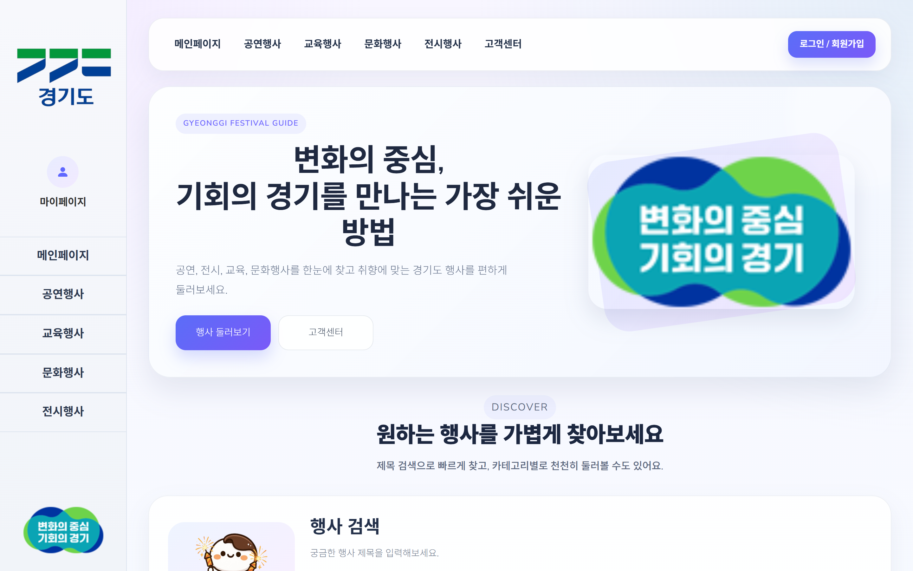
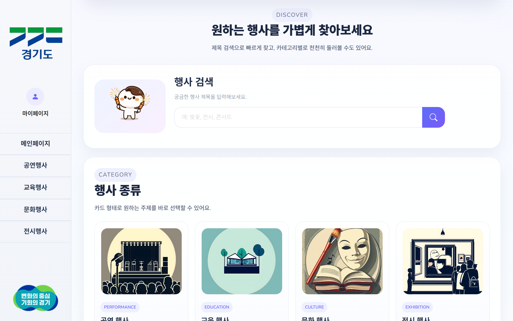
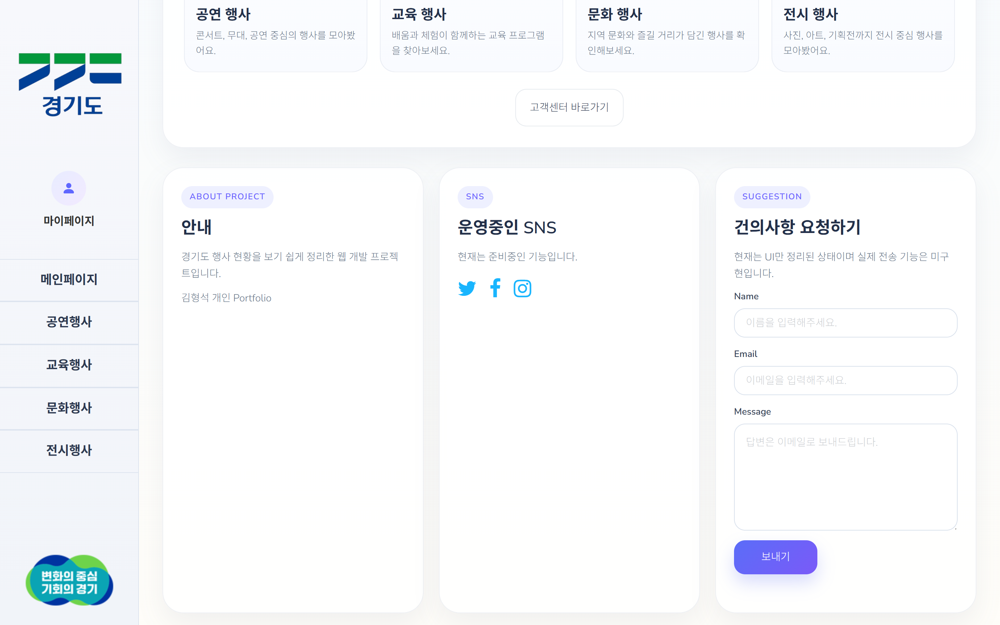

# GGNOW
경기도 행사/축제 정보를 한눈에 조회할 수 있는 웹 서비스입니다.  
공공데이터 API를 활용해 행사 정보를 제공하고, 회원 기능을 통해 즐겨찾기와 리뷰를 관리할 수 있도록 구현했습니다.

 

## 1. 프로젝트 소개

기존에는 경기도 행사 정보를 한 곳에서 편하게 찾기 어렵다고 느꼈습니다.  
이 문제를 해결하기 위해 공연, 교육, 문화, 전시 행사를 카테고리별로 조회하고, 검색과 상세 조회, 즐겨찾기, 리뷰 기능까지 제공하는 웹 서비스를 개발했습니다.

특히 단순 조회에 그치지 않고,  
사용자 입장에서 자주 보는 행사 저장, 후기 작성, 마이페이지 확인까지 가능하도록 구성했습니다.

 

## 2. 배포 주소

- Render 배포 주소: https://ggnow-portfolio.onrender.com/main
- Railway 배포 주소: https://ggnow-portfolio-production.up.railway.app/main
- GitHub Repository: [https://github.com/HyeongSeok7/GGNOW-Portfolio](https://github.com/HyeongSeok7/GGNOW-Portfolio)

 

## 3. 기술 스택

### Backend
- Java 17
- Spring Boot 3.3.4
- Spring MVC
- Spring Security
- Spring Data JPA
- Thymeleaf

### Database
- MariaDB

### Frontend
- HTML
- CSS
- JavaScript

### Infra / Deploy
- Railway

### External API
- 경기도 공공데이터 API

 

## 4. 주요 기능

### 4-1. 행사 목록 조회
- 공공데이터 API를 통해 경기도 행사 정보를 불러옵니다.
- 공연 / 교육 / 문화 / 전시 카테고리별로 페이지를 분리해 조회할 수 있습니다.

### 4-2. 행사 검색
- 사용자가 입력한 제목 키워드를 기준으로 행사를 검색할 수 있습니다.

### 4-3. 행사 상세 조회
- 선택한 행사에 대해 상세 정보를 확인할 수 있습니다.
- 상세 페이지에서 행사 정보와 함께 리뷰 및 즐겨찾기 기능을 사용할 수 있습니다.

### 4-4. 회원가입 / 로그인
- 회원가입 시 아이디 중복 확인 기능을 제공합니다.
- Spring Security 기반 로그인 / 로그아웃 기능을 구현했습니다.
- 비밀번호는 BCrypt로 암호화하여 저장했습니다.

### 4-5. 즐겨찾기
- 로그인한 사용자는 관심 있는 행사를 즐겨찾기에 추가 / 삭제할 수 있습니다.
- 마이페이지에서 즐겨찾기한 행사 목록을 확인할 수 있습니다.

### 4-6. 리뷰 기능
- 로그인한 사용자는 행사별 리뷰를 작성할 수 있습니다.
- 작성자는 본인이 작성한 리뷰만 수정 / 삭제할 수 있도록 처리했습니다.
- 마이페이지에서 내가 작성한 리뷰를 모아볼 수 있습니다.

### 4-7. 비밀번호 변경
- 현재 비밀번호 검증 후 새 비밀번호로 변경할 수 있습니다.
- 비밀번호 변경 후에는 보안을 위해 다시 로그인하도록 처리했습니다.

 

## 5. 실행 화면

### 메인 페이지

### 카테고리 페이지

### 상세 페이지

### 로그인 / 회원가입

### 마이페이지

### 리뷰

### 검색

 

## 6. 프로젝트 구조

~~~bash
src
├─ main
│  ├─ java/com/project/web
│  │  ├─ configuration
│  │  ├─ controller
│  │  ├─ dto
│  │  ├─ model
│  │  ├─ repository
│  │  └─ service
│  └─ resources
│     ├─ static
│     │  ├─ assets
│     │  └─ images
│     └─ templates
└─ test
~~~

 

## 7. ERD

<!-- 여기에 ERD 이미지 넣기 -->

현재 프로젝트에서는 다음과 같은 주요 엔티티를 사용했습니다.

- User
- Review
- FavoriteEvent
- FestivalEntity

 

## 8. 주요 설계 내용

### 8-1. 사용자 인증 및 보안
- Spring Security를 적용해 인증이 필요한 페이지와 비회원 접근 가능 페이지를 구분했습니다.
- 사용자 비밀번호는 BCryptPasswordEncoder를 사용해 암호화했습니다.

### 8-2. 행사 데이터 처리
- 외부 공공데이터 API에서 XML 데이터를 받아와 파싱했습니다.
- 중복 행사 데이터가 존재할 수 있어, 제목, 날짜, 시간, 주소, 참가비 정보를 기준으로 중복 제거 로직을 구현했습니다.

### 8-3. 캐시 적용
- 행사 목록 조회 시 매번 외부 API를 호출하지 않도록 캐시를 적용했습니다.
- 일정 주기로 캐시를 비우고 다시 적재하도록 구성해 성능과 최신성 사이의 균형을 맞추고자 했습니다.

### 8-4. 권한 처리
- 리뷰 수정 / 삭제는 작성자 본인만 가능하도록 검증 로직을 추가했습니다.
- 즐겨찾기와 리뷰 작성은 로그인 사용자만 사용할 수 있도록 처리했습니다.

 

## 9. 트러블슈팅 / 고민한 부분

### 9-1. 외부 API 데이터 중복 문제
공공데이터 API에서 같은 행사로 보이는 데이터가 중복되어 들어오는 경우가 있었습니다.  
단순히 제목만 비교하면 다른 행사까지 같은 것으로 처리될 수 있어, 제목뿐 아니라 날짜, 시간, 주소, 참가비 정보를 함께 조합해 중복 제거 기준을 만들었습니다.

### 9-2. 즐겨찾기 중복 저장 문제
같은 사용자가 동일한 행사를 여러 번 즐겨찾기하지 못하도록, 사용자명과 행사 ID를 기준으로 중복 저장을 방지했습니다.

### 9-3. 리뷰 권한 문제
리뷰 수정 / 삭제 기능 구현 시, 모든 사용자가 다른 사람의 리뷰까지 수정할 수 없도록 작성자 검증 로직을 추가했습니다.

### 9-4. 비밀번호 변경 후 보안 처리
비밀번호 변경 직후 기존 세션을 유지하면 보안상 문제가 될 수 있다고 판단해, 비밀번호 변경 후 자동 로그아웃되도록 처리했습니다.

 

## 10. 아쉬운 점

- 고객센터의 건의사항 전송 기능은 UI만 구현되어 있고 실제 전송 기능은 아직 미구현 상태입니다.
- 테스트 코드가 아직 충분하지 않아, 추후 단위 테스트와 통합 테스트를 보완하고 싶습니다.
- 검색 기능은 현재 기본적인 키워드 검색 중심이어서, 추후 카테고리 / 날짜 기반 필터링 기능을 추가하고 싶습니다.

 

## 11. 개선 방향

- 이메일 전송 기반 문의 기능 추가
- 검색 조건 세분화
- 페이징 처리
- 테스트 코드 보강
- 예외 처리 및 사용자 메시지 개선
- UI/UX 고도화

 

## 12. 환경 변수

프로젝트 실행을 위해 아래 환경 변수가 필요합니다.

~~~properties
API_BASE_URL=your_api_url
API_KEY=your_api_key

DB_URL=your_db_url
DB_USER=your_db_user
DB_PASSWORD=your_db_password

PORT=8080
~~~

 

## 13. 로컬 실행 방법

~~~bash
git clone https://github.com/HyeongSeok7/GGNOW-Portfolio.git
cd GGNOW-Portfolio
./gradlew bootRun
~~~

또는 IDE에서 실행 시 `WebApplication`을 실행하면 됩니다.

 

## 14. 회고

이번 프로젝트를 통해 단순한 화면 구현을 넘어서,  
회원 인증, 데이터베이스 연동, 외부 API 처리, 권한 검증, 배포까지 웹 서비스의 전체 흐름을 경험할 수 있었습니다.

특히 백엔드 개발자로서 다음과 같은 부분을 직접 고민하고 구현해본 경험이 의미 있었습니다.

- 데이터를 어떻게 저장하고 관리할지
- 사용자 권한을 어떻게 통제할지
- 외부 데이터를 어떻게 안정적으로 가공할지

앞으로는 테스트 코드 작성과 예외 처리, 서비스 구조 분리를 더 보완하여  
더 안정적인 백엔드 서비스를 개발할 수 있도록 발전시키고 싶습니다.