# GGNOW

> **경기도 행사 · 축제 정보를 한눈에 조회하고 서비스를 제공할 수 있는 웹 서비스**  
> 공공데이터 API를 활용해 행사 정보를 제공하고, 회원 기능을 통해 **즐겨찾기**, **리뷰**, **마이페이지**까지 사용할 수 있도록 구현한 백엔드 중심 포트폴리오 프로젝트입니다.

---


## 프로젝트 개요

기존에는 경기도 행사 정보를 한 곳에서 편하게 찾기 어렵다고 느꼈습니다.  
이 문제를 해결하기 위해 **공연 / 교육 / 문화 / 전시** 카테고리별 조회, 검색, 상세 조회, 즐겨찾기, 리뷰 기능을 제공하는 웹 서비스를 개발했습니다.

단순 조회 서비스에 그치지 않고, 사용자분들이 직접 행사를 저장하고 후기를 남기며 행사 경험을 공유할 수 있으며 마이페이지에서 활동 내역을 확인할 수 있도록 구성했습니다.

### 핵심 포인트
- 공공데이터 API 연동
- Spring Security 기반 회원 인증
- 즐겨찾기 / 리뷰 / 마이페이지 기능 구현
- 외부 데이터 정제 및 중복 제거 로직 적용
- 캐시 적용 및 주기적 갱신 처리
- Railway / Render 배포 경험

---

## 배포 주소

- **Render**: `https://ggnow-portfolio.onrender.com/main`
(Render 무료 인스턴스 특성상 일정 시간 미사용 후 첫 요청 시 서버가 다시 기동되며, 초기 접속에 시간이 걸릴 수 있습니다.)
- **Railway**: `https://ggnow-portfolio-production.up.railway.app/main` (요금 문제로 현재 비활성화 상태입니다.)
- **GitHub Repository**: `https://github.com/HyeongSeok7/GGNOW-Portfolio`

---

## 기술 스택

### Backend
- Java 17
- Spring Boot 3.3.4
- Spring MVC
- Spring Security
- Spring Data JPA
- Thymeleaf

### Database
- MariaDB

### Frontend
- HTML
- CSS
- JavaScript
- Thymeleaf

### Infra / Deploy
- Railway
- aiven
- Render
- Docker

### External API
- 경기도 공공데이터 API

---

## 주요 기능

### 1. 행사 목록 조회
- 경기도 공공데이터 API에서 행사 데이터를 받아와 화면에 출력합니다.
- **공연 / 교육 / 문화 / 전시** 카테고리별 페이지를 분리해 조회할 수 있습니다.

### 2. 행사 검색
- 사용자가 입력한 키워드를 기준으로 행사 정보를 검색할 수 있습니다.
- 검색 시 단순 제목 비교가 아니라, 공백과 특수문자를 정리한 정규화 값을 기준으로 비교합니다.
- 행사 제목뿐 아니라 **주최 기관명, 주소**도 함께 검색 대상에 포함하여 사용자가 더 쉽게 행사를 찾을 수 있도록 개선했습니다.

### 3. 행사 상세 조회
- 행사 목록 및 검색 결과에서 선택한 행사 상세 페이지로 이동할 수 있습니다.
- 초기에는 행사 제목을 URL 식별자로 사용했지만, 특수문자나 동일 제목 행사 문제로 인해 내부 식별자인 `festivalId` 기반 상세 조회 구조로 변경했습니다.
- `festivalId`는 외부 API 데이터의 제목만으로 생성하지 않고, **제목 / 시작일 / 종료일 / 시간 / 주소 / 참가비**를 조합한 `identityKey`를 기준으로 생성합니다.
- 이를 통해 같은 제목의 다른 행사도 서로 다른 행사로 구분할 수 있으며, 리뷰와 즐겨찾기 기능을 더 안정적으로 연결할 수 있습니다.

### 4. 회원가입 / 로그인
- 회원가입 시 **아이디 중복 확인** 기능을 제공합니다.
- Spring Security 기반 로그인 / 로그아웃을 구현했습니다.
- 비밀번호는 **BCrypt**로 암호화하여 저장했습니다.

### 5. 즐겨찾기
- 로그인한 사용자는 관심 있는 행사를 즐겨찾기에 추가 / 삭제할 수 있습니다.
- 마이페이지에서 즐겨찾기한 행사 목록을 확인할 수 있습니다.

### 6. 리뷰 기능
- 로그인한 사용자는 행사별 리뷰를 작성할 수 있습니다.
- 리뷰 수정 / 삭제는 **작성자 본인만 가능**하도록 권한 검증을 적용했습니다.
- 마이페이지에서 내가 작성한 리뷰를 확인할 수 있습니다.

### 7. 비밀번호 변경
- 현재 비밀번호 검증 후 새 비밀번호로 변경할 수 있습니다.
- 비밀번호 변경 후에는 보안을 위해 다시 로그인하도록 처리했습니다.

---

## 주요 엔드포인트

### 페이지 라우팅
- `GET /main` : 메인 페이지
- `GET /culture` : 문화 행사 카테고리 페이지
- `GET /education` : 교육 행사 카테고리 페이지
- `GET /exhibition` : 전시 행사 카테고리 페이지
- `GET /performance` : 공연 행사 카테고리 페이지
- `GET /festival/id/{festivalId}` : 내부 식별자 기준 행사 상세 페이지
- `GET /festival/{title}` : 기존 제목 기반 접근 **호환용** 경로 (내부적으로 id 기반 상세 페이지로 연결)
- `GET /search?keyword={keyword}` : 행사 검색 결과 페이지
- `GET /login` : 로그인 페이지
- `GET /register` : 회원가입 페이지
- `GET /mypage` : 마이페이지
- `GET /my-reviews` : 본인이 작성한 리뷰 조회 페이지
- `GET /change-password` : 비밀번호 변경 페이지
- `GET /customer` : 고객센터 페이지

### 인증 / 회원
- `POST /register` : 회원가입 처리
- `GET /register/check-username?username={username}` : 아이디 중복 확인
- `GET /check-login` : 로그인 상태 확인

### 리뷰 API
- `GET /festivals/{festivalId}/reviews` : 특정 행사 리뷰 목록 조회
- `POST /festivals/{festivalId}/reviews` : 특정 행사 리뷰 작성
- `PATCH /festivals/{festivalId}/reviews/{reviewId}` : 특정 리뷰 수정
- `DELETE /festivals/{festivalId}/reviews/{reviewId}` : 특정 리뷰 삭제

### 즐겨찾기 API
- `POST /addFavoriteEvent` : 즐겨찾기 추가
- `GET /getFavoriteEvents` : 내 즐겨찾기 목록 조회
- `DELETE /removeFavoriteEvent` : 즐겨찾기 삭제

---

## 실행 화면

### 서비스 시연 GIF
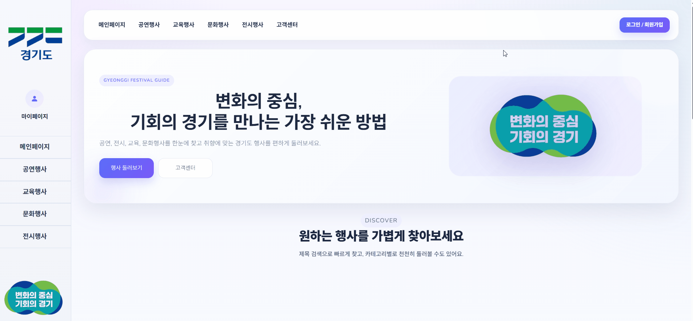

### 메인 페이지
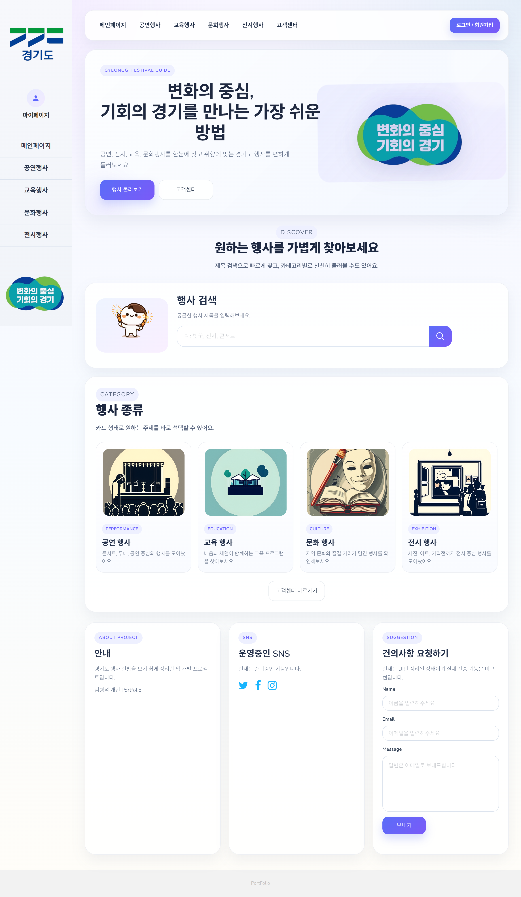


### 카테고리 페이지
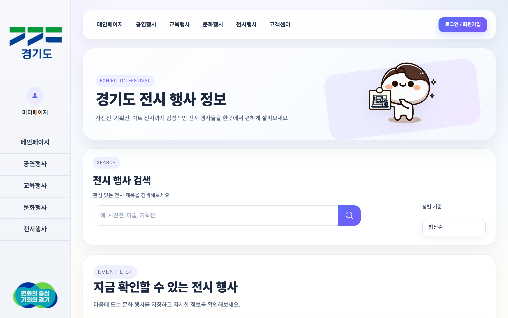
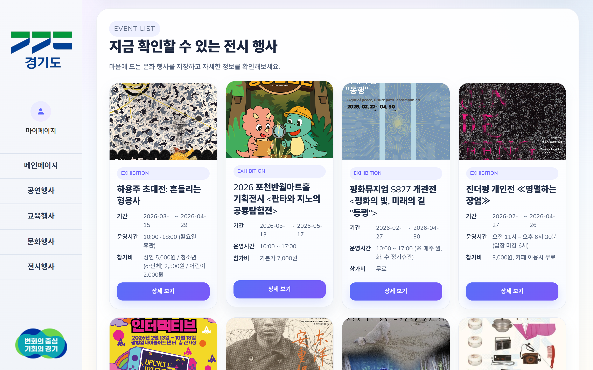
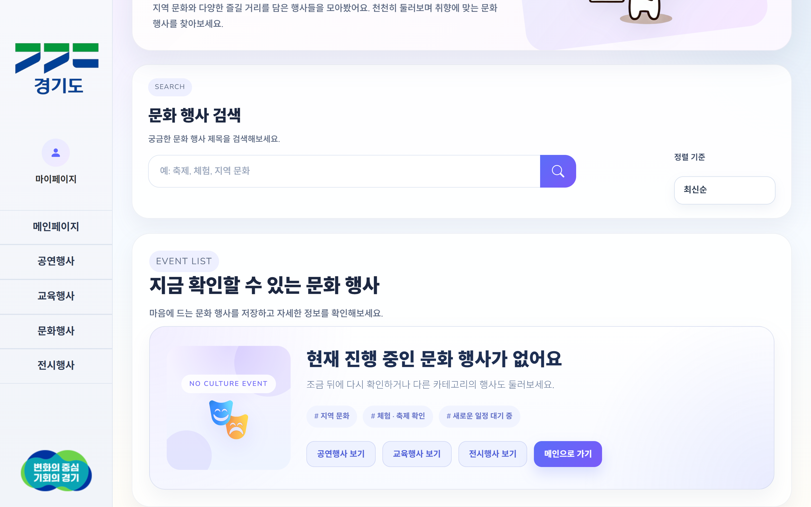

### 상세 페이지
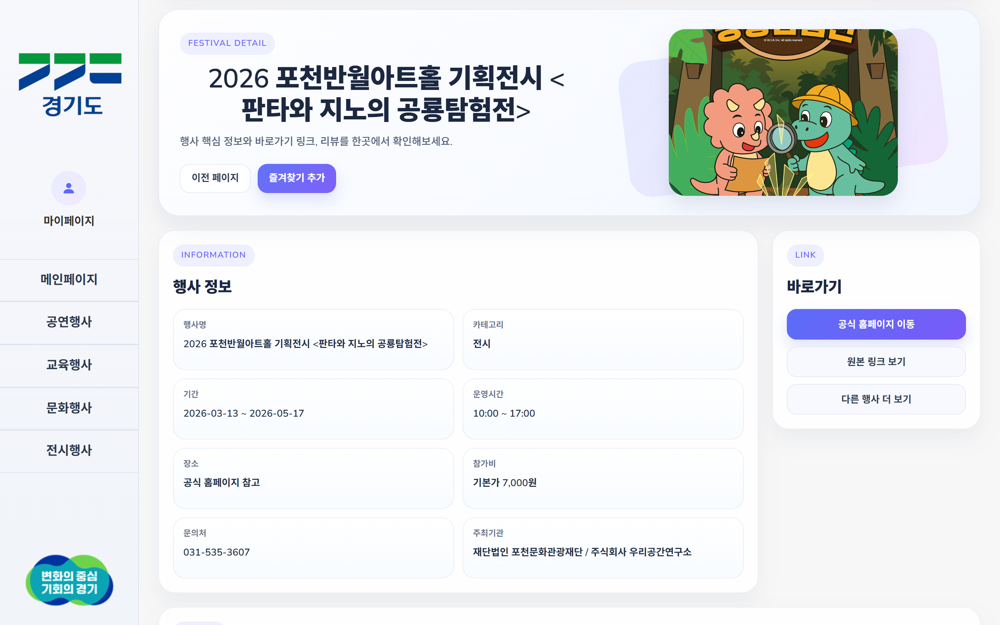

### 로그인 / 회원가입
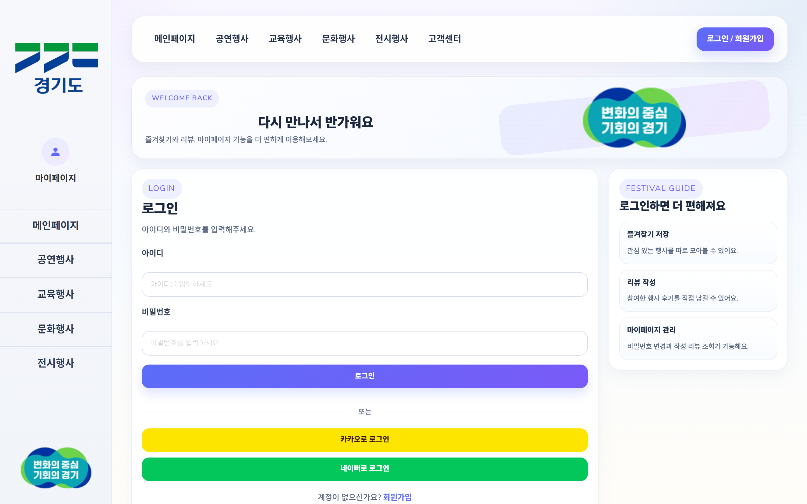
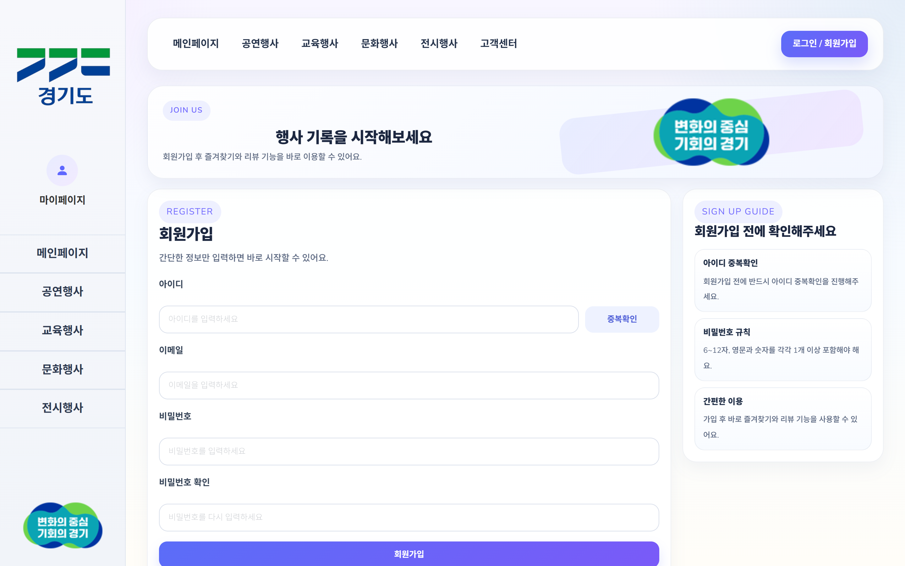

### 마이페이지
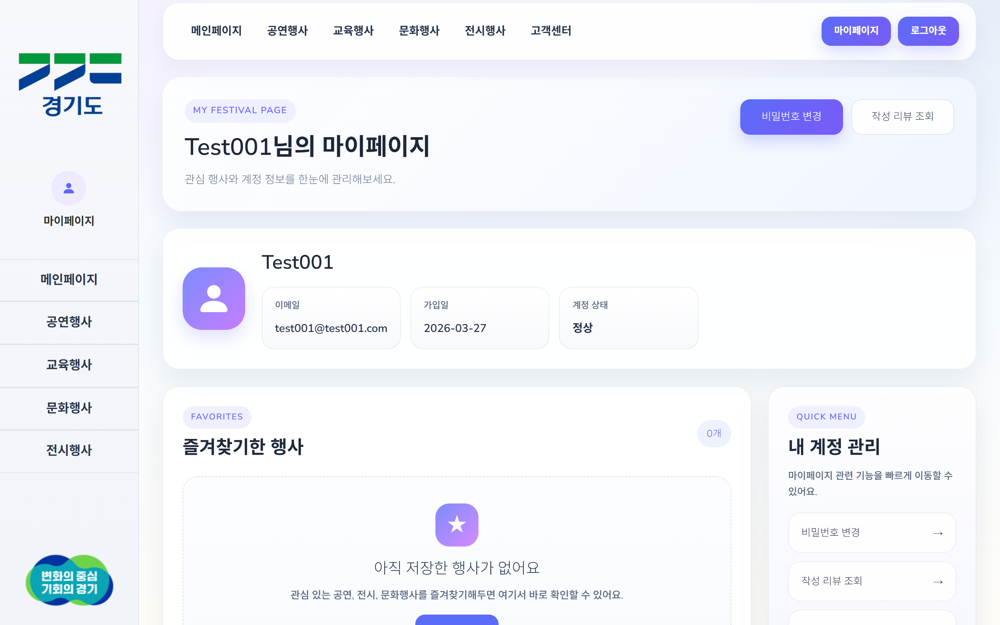
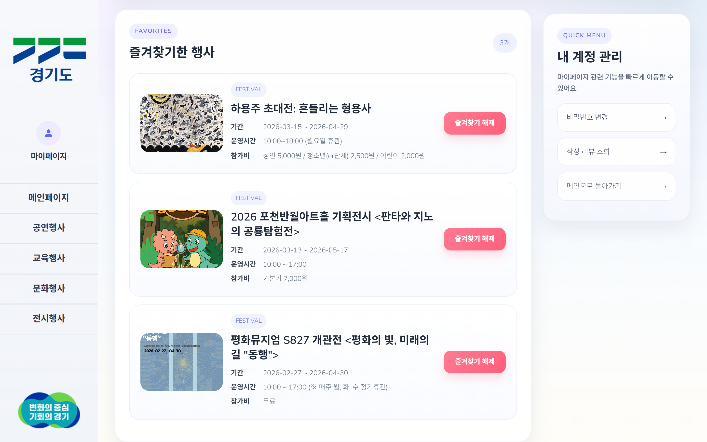
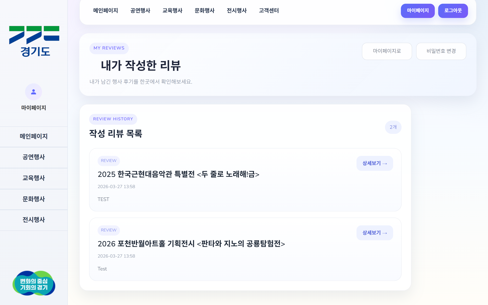
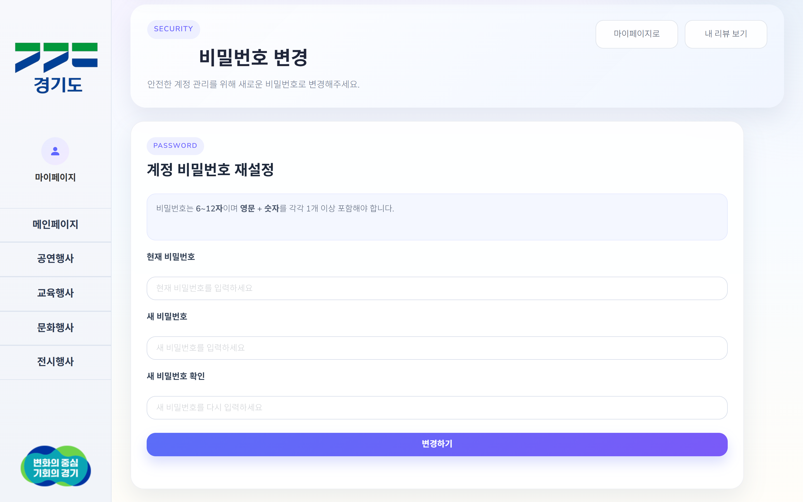

### 리뷰
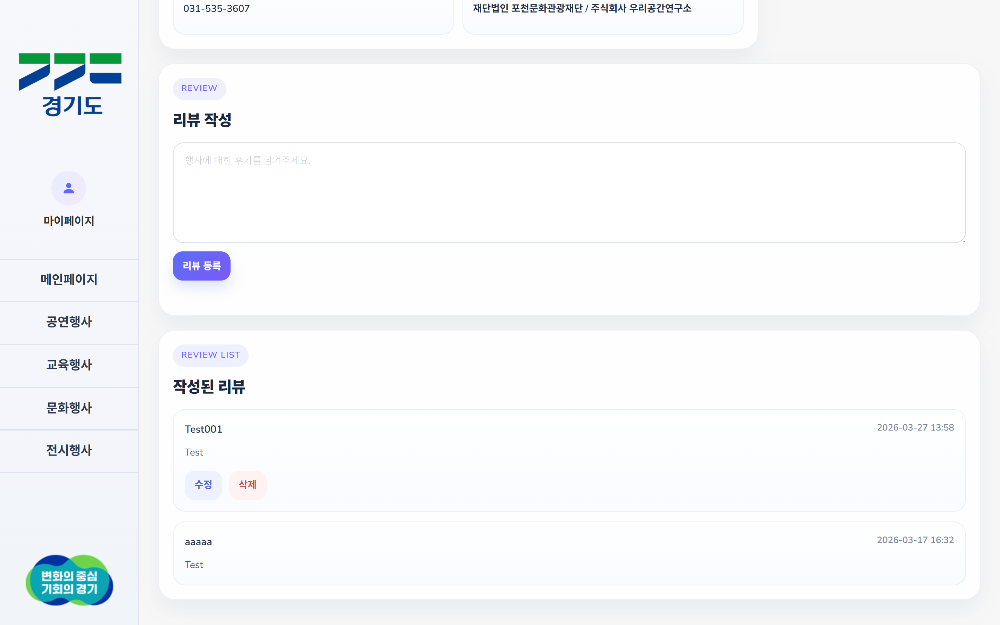

### 검색
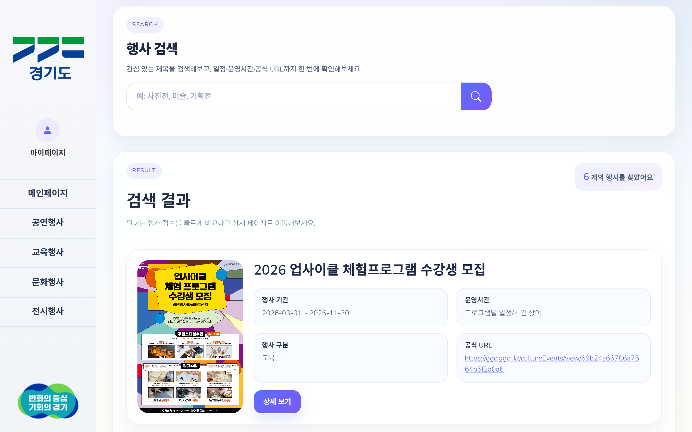

---

## 프로젝트 구조

```bash
src
├─ main
│  ├─ java/com/project/web
│  │  ├─ configuration   # Security, Web, RestTemplate 설정
│  │  ├─ controller      # 요청 처리 및 페이지/API 응답
│  │  ├─ dto             # 요청/응답 DTO
│  │  ├─ model           # 엔티티 및 외부 API 응답 모델
│  │  ├─ repository      # JPA Repository
│  │  └─ service         # 비즈니스 로직
│  └─ resources
│     ├─ static
│     │  ├─ assets       # CSS, JS
│     │  └─ images       # 이미지 리소스
│     └─ templates       # Thymeleaf 템플릿
└─ test
```
## ERD

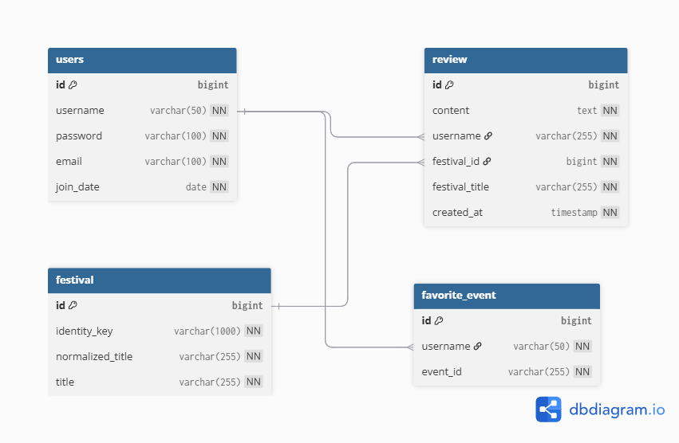

### 주요 엔티티
- **User** : 회원 정보 관리
- **Review** : 행사별 리뷰 저장
- **FavoriteEvent** : 회원별 즐겨찾기 행사 저장
- **FestivalEntity** : 외부 API 행사 데이터를 내부 기능과 연결하기 위한 식별 엔티티
  - `id` : 서비스 내부에서 사용하는 행사 식별자
  - `identityKey` : 제목 / 날짜 / 시간 / 주소 / 참가비를 조합한 행사 식별 키
  - `normalizedTitle` : 검색 및 비교를 위해 정규화한 행사 제목
  - `title` : 화면 표시용 원본 행사 제목

---

## 설계 및 구현 포인트

### 1. 사용자 인증 및 보안
- Spring Security를 적용해 **비회원 접근 가능 페이지**와 **로그인이 필요한 기능**을 분리했습니다.
- 사용자 비밀번호는 `BCryptPasswordEncoder`를 사용해 암호화했습니다.
- 비밀번호 변경 시 현재 비밀번호를 검증하고, 변경 후에는 세션을 종료해 다시 로그인하도록 처리했습니다.

### 2. 외부 API 데이터 처리
- 경기도 공공데이터 API의 XML 응답을 받아 행사 정보를 파싱하도록 구현했습니다.
- 외부 API 데이터에는 같은 행사가 중복으로 내려오거나, 제목 표기가 조금씩 다른 데이터가 포함될 수 있었습니다.
- 이를 해결하기 위해 제목만 기준으로 중복을 판단하지 않고, **제목 / 시작일 / 종료일 / 시간 / 주소 / 참가비**를 조합한 fingerprint를 생성해 중복 제거 기준으로 사용했습니다.
- 중복 데이터가 발견될 경우 이미지, 홈페이지 URL 등 정보가 더 풍부한 데이터를 우선 선택하도록 처리했습니다.

### 3. 외부 행사 데이터와 내부 식별자 분리
- 외부 API 행사 데이터에는 서비스 내부에서 그대로 사용할 수 있는 고정 PK가 없었습니다.
- 초기에는 정규화된 행사 제목을 기준으로 내부 `festivalId`를 생성했지만, 같은 제목의 다른 행사가 존재할 경우 리뷰와 즐겨찾기가 잘못 연결될 수 있다는 한계가 있었습니다.
- 이를 개선하기 위해 `FestivalEntity`에 `identityKey`를 추가하고, **제목 / 시작일 / 종료일 / 시간 / 주소 / 참가비**를 조합한 값을 내부 식별 기준으로 사용했습니다.
- 사용자가 행사 목록, 검색 결과, 마이페이지에서 상세 페이지로 이동할 때 모두 내부 `festivalId`를 사용하도록 구성했습니다.
- 결과적으로 외부 API의 문자열 데이터와 서비스 내부 식별자를 분리하여, 리뷰 / 즐겨찾기 / 상세 페이지 연결의 안정성을 높였습니다.

### 4. 캐시 적용
- 행사 목록 조회 시 매번 외부 API를 호출하지 않도록 캐시를 적용했습니다.
- 일정 주기마다 캐시를 비우고 재적재하도록 구성해 **성능**과 **데이터 최신성**을 함께 고려했습니다.

### 5. 권한 처리
- 리뷰 수정 / 삭제는 작성자 본인만 가능하도록 검증 로직을 구현했습니다.
- 즐겨찾기 추가 / 삭제와 리뷰 작성은 로그인 사용자만 가능하도록 제한했습니다.

---

## 트러블슈팅

### 1. 외부 API 데이터에 중복 행사가 포함되는 문제

#### 문제
- 같은 행사가 제목 표기만 조금 다르게 여러 번 내려오는 경우가 있었습니다.
- 제목만 기준으로 처리하면 서로 다른 행사가 겹칠 수 있었고, 반대로 그대로 두면 같은 행사가 중복 노출되는 문제가 있었습니다.

#### 해결
- 제목을 정규화한 뒤, **날짜 / 시간 / 주소 / 참가비**까지 조합한 fingerprint 기준으로 중복 제거 로직을 적용했습니다.
- 중복이 발생한 경우에는 이미지, 홈페이지 URL 등 정보가 더 풍부한 데이터를 우선 선택하도록 처리했습니다.

#### 배운 점
- 외부 API 데이터를 항상 신뢰하기보다, 서비스 목적에 맞게 정제하는 로직이 필요하다는 점을 배웠습니다.

### 2. 리뷰 / 즐겨찾기 기능에서 행사 식별이 불안정했던 문제

#### 문제
- 외부 API 행사 데이터는 내부 DB의 고정 PK가 아니기 때문에, 리뷰와 즐겨찾기를 어떤 기준으로 연결할지 고민이 필요했습니다.
- 초기에는 정규화된 제목을 기준으로 내부 `FestivalEntity`를 생성했지만, 같은 제목을 가진 다른 행사가 존재할 수 있다는 문제가 있었습니다.
- 예를 들어 같은 제목의 행사가 날짜나 장소만 다르게 열릴 경우, 제목만으로 구분하면 서로 다른 행사가 하나의 행사처럼 처리될 수 있었습니다.

#### 해결
- `FestivalEntity`에 `identityKey` 컬럼을 추가했습니다.
- `identityKey`는 행사 제목만 사용하지 않고, **제목 / 시작일 / 종료일 / 시간 / 주소 / 참가비**를 조합해 생성했습니다.
- `festivalId` 생성 시 기존의 `normalizedTitle` 기준 조회가 아니라 `identityKey` 기준 조회로 변경했습니다.
- 행사 목록, 검색 결과, 마이페이지에서 상세 페이지로 이동할 때 모두 동일한 방식으로 `identityKey`를 생성하고, 해당 값에 매핑된 내부 `festivalId`를 사용하도록 수정했습니다.

#### 배운 점
- 외부 API 데이터는 화면에 표시하는 값과 내부 식별자로 사용하는 값을 분리해야 안정적으로 관리할 수 있다는 점을 배웠습니다.
- 특히 리뷰, 즐겨찾기처럼 DB에 저장되는 사용자 데이터는 외부 문자열 값에 직접 의존하기보다, 서비스 내부에서 관리하는 식별자를 기준으로 연결하는 것이 더 안전하다는 점을 알게 되었습니다

### 3. 제목 기반 상세 페이지 라우팅이 불안정했던 문제

#### 문제
- 초기에는 행사 제목을 URL path variable로 사용해 상세 페이지에 진입하도록 구현했습니다.
- 하지만 외부 API 데이터에는 `<아이돌; Children Stone>`처럼 특수문자가 포함된 제목이 존재했고, 이 경우 상세 페이지로 정상적으로 접속할 수 없는 문제가 발생했습니다.
- 제목 문자열은 화면 표시 용도로는 적합하지만, URL 식별자나 내부 기능 연결 기준으로 사용하기에는 불안정하다는 점을 확인했습니다.

#### 해결
- 상세 페이지 진입 기준을 제목 기반이 아닌 내부 식별자인 `festivalId` 기반으로 변경했습니다.
- 기존 제목 기반 경로는 호환용으로 유지하되, 내부적으로는 `identityKey` 기준으로 `festivalId`를 조회하거나 생성한 뒤 `/festival/id/{festivalId}` 경로로 리다이렉트되도록 처리했습니다.
- 행사 목록, 검색 결과, 마이페이지에서 상세 페이지로 이동할 때 모두 `festivalId`를 사용하도록 수정했습니다.

#### 배운 점
- 외부 API의 문자열 데이터는 사용자에게 보여주는 값과 시스템 내부 식별 값으로 분리해서 설계해야 한다는 점을 배웠습니다.
- 특히 URL 라우팅이나 권한/리소스 연결에는 변동 가능성이 있는 문자열보다 안정적인 내부 식별자를 사용하는 것이 유지보수와 확장성 면에서 훨씬 유리하다는 점을 체감했습니다.

### 4. 비밀번호 변경 후 보안 처리

#### 문제
- 비밀번호만 변경하고 기존 세션을 그대로 유지하면, 보안상 애매한 사용자 경험이 될 수 있다고 판단했습니다.

#### 해결
- 비밀번호 변경 성공 시 현재 세션을 종료하고, 다시 로그인하도록 처리했습니다.

#### 배운 점
- 단순 기능 구현을 넘어서, 실제 서비스 관점에서 인증 흐름을 설계해야 한다는 점을 느꼈습니다.

### 5. 애니메이션을 주는 스크립트가 동작하지 않는 것처럼 보였던 문제

#### 문제
- 페이지 전환 효과와 행사 카드 등장 애니메이션이 적용되지 않아 스크립트가 정상적으로 실행되지 않는 것처럼 보였습니다.
- 스크립트 문장을 새로 작성해보거나 애니메이션 수치와 시간을 크게 조정해도 화면상 변화가 없어, 처음에는 JavaScript 코드 자체의 문제의 문제라고 판단했습니다.

#### 원인
- 원인을 추적하는 과정에서 코드 문제가 아니라, 운영체제 Windows의 모션 줄이기 설정이 활성화되어 있는 것이 원인이었습니다.
- 이 설정으로 인해 애니메이션 관련 효과가 제한되거나 비활성화되면서, 스크립트가 동작하지 않는 것처럼 보였습니다.

#### 해결
- Windows의 접근성 설정까지 함께 점검하면서 문제 원인을 다시 확인하였습니다.
- 이후 애니메이션 관련 문제를 디버깅 할 때는 코드뿐 아니라 **브라우저 환경, 운영체제 설정, 접근성옵션** 도 함께 확인하는 방식으로 점검 범위를 넓혔습니다.

#### 배운 점
- 프론트엔드 동작 문제는 항상 코드 자체만의 문제가 아닐 수 있다는 점을 배웠습니다. 
- 특히 애니메이션이나 인터랙션 기능은 사용자 환경 설정의 영향을 받을 수 있기 때문에, 디버깅 시 실행 환경까지 함께 고려하는 습관이 중요하다는 것을 깨달았습니다.

### 6. 행사 식별 기준 변경 후 DB 제약조건 충돌 문제

#### 문제
- 행사 식별 기준을 `normalizedTitle`에서 `identityKey`로 변경한 뒤, 카테고리 페이지 접속 시 500 에러가 발생했습니다.
- 원인은 기존 DB에 남아 있던 `normalized_title` unique 제약조건이었습니다.
- 코드에서는 같은 제목의 다른 행사도 저장할 수 있도록 `identityKey` 기준으로 변경했지만, DB에는 여전히 "같은 normalizedTitle은 저장할 수 없다"는 이전 제약조건이 남아 있었습니다.

#### 해결
- 개발 환경에서는 기존 행사 관련 테이블을 초기화했습니다.
- 이후 `FestivalEntity`의 unique 기준을 `identity_key`로 다시 생성하여, 같은 제목의 다른 행사도 날짜 / 시간 / 장소 / 참가비가 다르면 별도 행사로 저장될 수 있도록 수정했습니다.

---

## 아쉬운 점

- 고객센터의 **건의사항 전송 기능**은 UI만 구현되어 있고 실제 전송 기능은 아직 미구현 상태입니다.
- 이번 프로젝트는 기능 구현과 배포 흐름을 우선으로 진행했으며, 주요 기능은 회원가입, 로그인, 상세 조회, 리뷰, 즐겨찾기, 마이페이지 중심으로 수동 검증했습니다.
- 추후에는 핵심 서비스 로직부터 단위 테스트를 보완해 안정성을 높일 계획입니다.
- 검색 기능은 제목 / 기관명 / 주소 기준으로 개선했지만, 아직 날짜 범위, 지역, 카테고리 등 세부 조건 기반 필터링은 부족합니다.
- 현재 `Review`와 `FavoriteEvent`는 `festivalId`, `username` 값을 중심으로 연결하고 있어 기능 구현에는 문제가 없지만, 추후에는 JPA 연관관계를 더 명확하게 표현하도록 리팩토링하고 싶습니다.

---

## 개선 방향

- 이메일 전송 또는 DB 저장 기반 문의 기능 추가
- 날짜 / 지역 / 카테고리 기반 검색 조건 세분화
- 행사 목록 페이징 처리
- 핵심 서비스 로직 단위 테스트 보강
- 운영 환경 설정 분리 및 배포 설정 고도화
- 예외 처리 및 사용자 메시지 개선
- `Review`, `FavoriteEvent`와 `User`, `FestivalEntity` 간 JPA 연관관계 리팩토링
- UI/UX 고도화

---

## 환경 변수

프로젝트 실행을 위해 아래 환경 변수가 필요합니다.

```properties
API_BASE_URL=https://openapi.gg.go.kr/GGCULTUREVENTSTUS
API_KEY=your_api_key
API_PAGE_INDEX=1
API_PAGE_SIZE=200

DB_URL=your_db_url
DB_USER=your_db_user
DB_PASSWORD=your_db_password

PORT=8080
```

---

## 로컬 실행 방법

```bash
git clone https://github.com/HyeongSeok7/GGNOW-Portfolio.git
cd GGNOW-Portfolio
./gradlew bootRun
```

또는 IDE에서 `WebApplication`을 실행하면 됩니다.

---

## 회고

이번 프로젝트를 통해 단순한 화면 구현을 넘어서, **회원 인증**, **데이터베이스 연동**, **외부 API 처리**, **권한 검증**, **배포**까지 웹 서비스의 전체 흐름을 경험할 수 있었습니다.

특히 백엔드 개발자로서 아래와 같은 부분을 직접 고민하고 구현해본 경험이 의미 있었습니다.

- 외부 API 데이터를 어떻게 정제하고 사용할지
- 화면 표시용 데이터와 내부 식별자를 어떻게 분리할지
- 사용자 권한을 어떻게 통제할지
- 리뷰와 즐겨찾기 같은 사용자 데이터를 어떤 기준으로 연결할지
- 실제 배포 환경에서 설정과 DB를 어떻게 관리할지

처음에는 행사 제목을 정규화해 내부 식별 기준으로 사용했지만, 같은 제목의 다른 행사가 존재할 수 있다는 한계를 발견했습니다. 이후 제목뿐 아니라 날짜, 시간, 주소, 참가비를 조합한 `identityKey`를 도입해 내부 `festivalId`를 발급하도록 개선했습니다.

이 과정을 통해 외부 데이터는 그대로 신뢰하기보다 서비스 목적에 맞게 정제하고, 사용자 데이터와 연결되는 부분은 내부 식별자를 기준으로 설계해야 한다는 점을 배웠습니다.

앞으로는 테스트 코드, 예외 처리, 검색 고도화, 운영 환경 설정 분리 등을 보완해 더 안정적인 백엔드 서비스를 개발할 수 있도록 발전시키고 싶습니다.